# Manual de usuario - Consola VYVA x Cruz Roja

Versión: 2026-06-20
Actualizado: 20 de junio de 2026
URL: https://rcadmin.vyva.life/manuals/VYVA_Admin_Console_User_Manual_ES.pdf

## 1. Propósito y alcance de la consola
La consola VYVA x Cruz Roja es un espacio operativo para coordinar seguimiento, llamadas, señales de riesgo, medicación, campañas y cobertura de cuidado para clientes mayores atendidos por una organización de Cruz Roja.
Este manual está escrito para administradores, coordinadores, operadores y personal profesional autorizado. Explica cómo usar la consola actual, qué datos debe mostrar cada área y qué acciones requieren integración externa antes de ejecutarse.
La consola debe usarse con criterio de mínima información necesaria: registrar únicamente los datos que ayudan a coordinar cuidado, seguimiento y seguridad. No debe convertirse en una historia clínica completa ni en un repositorio de información médica no operativa.
- Clientes son las personas atendidas por Cruz Roja.
- Miembros del equipo son usuarios internos con acceso a la consola.
- Contactos de emergencia son familiares, vecinos, cuidadores o contactos personales capturados durante onboarding o intake.
- Personal Cruz Roja es personal profesional asignable a clientes.

## 2. Inicio de sesión
El acceso visible es solo por correo electrónico. El administrador introduce su email y recibe un enlace mágico de inicio de sesión. Google y Microsoft están ocultos por ahora para evitar confusión hasta que se activen correctamente.
Supabase Auth se usa como capa de identidad para el enlace mágico. Replit mantiene los datos operativos: organizaciones, roles, equipos, clientes, campañas y asignaciones.
Si el email no tiene acceso concedido, la consola debe bloquear el acceso después del intento de inicio de sesión con un mensaje claro. El sistema no debe revelar detalles sensibles antes de enviar el enlace.
1. Abrir la URL publicada de la consola.
2. Introducir el email de administrador.
3. Revisar el correo recibido desde el dominio VYVA configurado.
4. Abrir el enlace mágico más reciente.
5. Confirmar que la organización mostrada es la correcta.

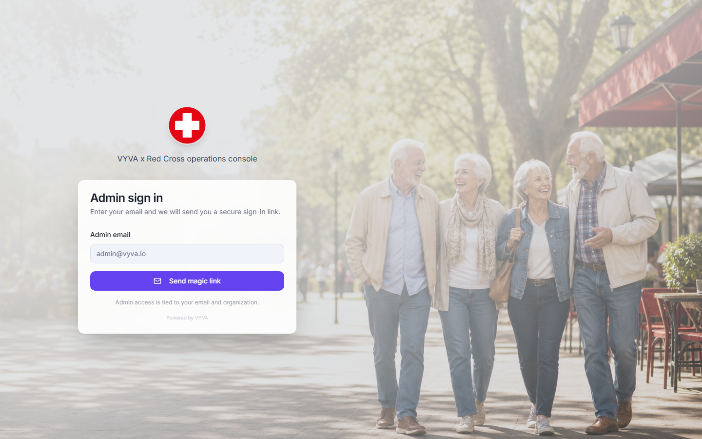
*Pantalla de inicio de sesión con acceso por enlace mágico.*

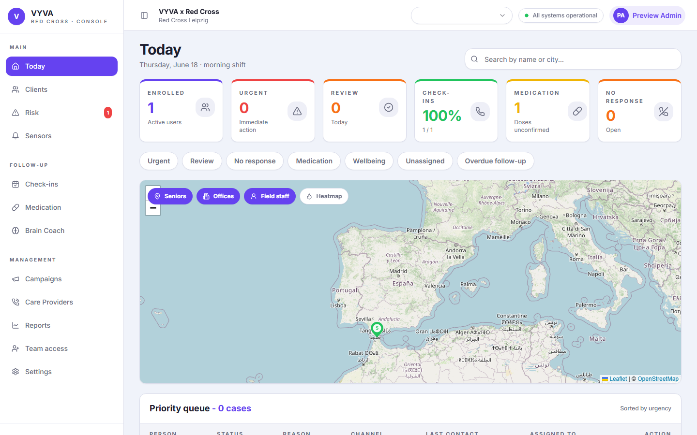
*Correo de acceso seguro con botón para abrir la consola VYVA.*

## 3. Roles y permisos
Los permisos se resuelven a partir del email autenticado y de los registros del backend. La interfaz debe mostrar el rol real del usuario, por ejemplo Super admin, Admin, Coordinador u Operador. No debe mostrar Operator si el usuario es Super admin.
Los superadmins no se crean desde la interfaz. Se conceden desde controles backend, como variables de entorno o campos de perfil administrados. Esto reduce el riesgo de elevar permisos por error.
| Rol | Alcance principal | Notas |
| --- | --- | --- |
| Super admin | Puede cambiar de organización y crear administradores por organización. | No se gestiona desde la UI. |
| Admin | Gestiona clientes, equipo, campañas, contactos, horarios y configuración de su organización. | Puede crear miembros de equipo. |
| Coordinador / operador | Revisa colas, clientes y tareas asignadas. | Las acciones sensibles pueden ser de solo lectura. |
| Personal Cruz Roja asignado | Puede editar planes o rutinas del cliente cuando es responsable principal y hay consentimiento. | No equivale a contacto de emergencia. |

## 4. Organización activa
La organización activa controla qué datos se muestran en toda la consola. Al cambiar de Red Cross Zamora a Red Cross Leipzig, deben cambiar los clientes, campañas, check-ins, Brain Coach, medicación, riesgo, contactos, personal, informes y mapa.
Red Cross Zamora usa español, España y zona horaria Europe/Madrid por defecto. Red Cross Leipzig usa alemán, Alemania y Europe/Berlin por defecto. El usuario puede cambiar idioma de interfaz si tiene permiso.
La asignación automática debe ser estricta: números y direcciones españolas pertenecen a Zamora; números y direcciones alemanas pertenecen a Leipzig. Un cliente no debe aparecer en otra organización por fallback genérico.
- El selector de organización aparece para superadmins o usuarios con más de una organización.
- El mapa debe centrarse en el país de la organización activa.
- Los endpoints deben recibir o resolver el contexto de organización antes de devolver datos.

## 5. Navegación general
La barra lateral agrupa las áreas en Principal, Seguimiento y Gestión. Las etiquetas deben ser consistentes: Clientes para personas atendidas, Riesgo para priorización operativa, Sensores para datos de dispositivos, Check-ins para llamadas de seguimiento, Brain Coach para sesiones cognitivas y Campañas para llamadas VYVA.
El encabezado superior muestra el nombre de la consola, la organización activa, el estado del sistema y el usuario conectado. Si hay selector de organización, el cambio debe refrescar los datos de la vista actual.
| Área | Uso |
| --- | --- |
| Today | Vista operativa diaria con métricas y mapa. |
| Clients | Cola de clientes y perfiles de cuidado. |
| Risk | Casos priorizados por riesgo, revisión, medicación, no respuesta o falta de asignación. |
| Sensors | Espacio reservado para datos de dispositivos cuando el backend esté listo. |
| Check-ins | Llamadas de seguimiento y su estado. |
| Brain Coach | Rutinas y reportes de actividad cognitiva. |
| Medication | Seguimiento de medicación y adherencia. |
| Campaigns | Campañas de llamadas VYVA. |

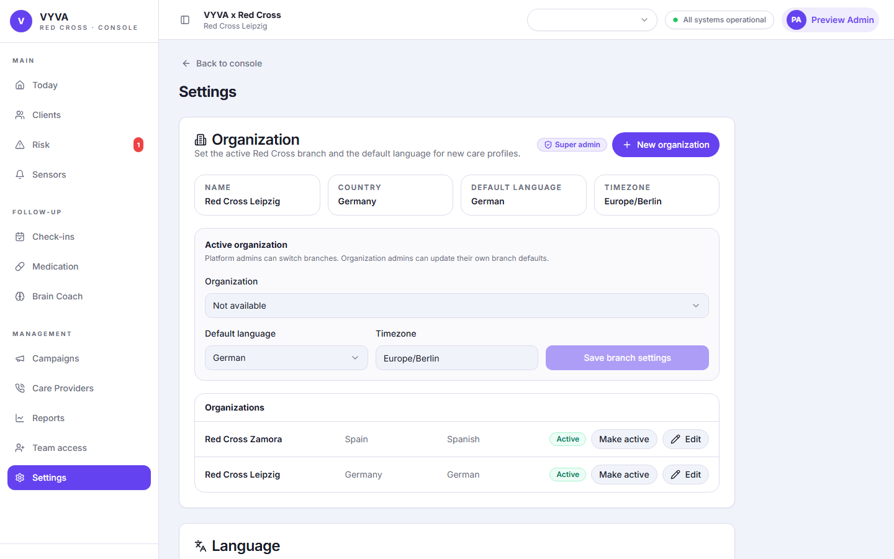
*Barra lateral con las áreas principales de la consola.*

## 6. Panel Today
Today resume el estado operativo de la organización activa. Las tarjetas superiores deben mostrar números calculados con lógica clara y periodo definido. Cuando el usuario hace clic en una tarjeta, debe poder ver la lista que explica el número cuando aplique.
El mapa debe estar arriba y debe mantener el comportamiento Leaflet: tamaño estable, resize correcto, tiles, clustering y viewport coherente. Debe mostrar clientes, oficinas y equipo de campo como capas.
Las métricas de check-ins deben ser semanales: completados frente a esperados durante la semana. No basta con mostrar 1/1 si la rutina es diaria y se esperan siete llamadas semanales.
- Inscritos: clientes activos en la organización.
- Urgente: clientes con señales que requieren acción inmediata.
- Revisar: clientes que necesitan evaluación del operador hoy.
- Check-ins: cumplimiento semanal real.
- Medicación: dosis o confirmaciones pendientes.
- Sin asignar: clientes sin cobertura operativa suficiente.

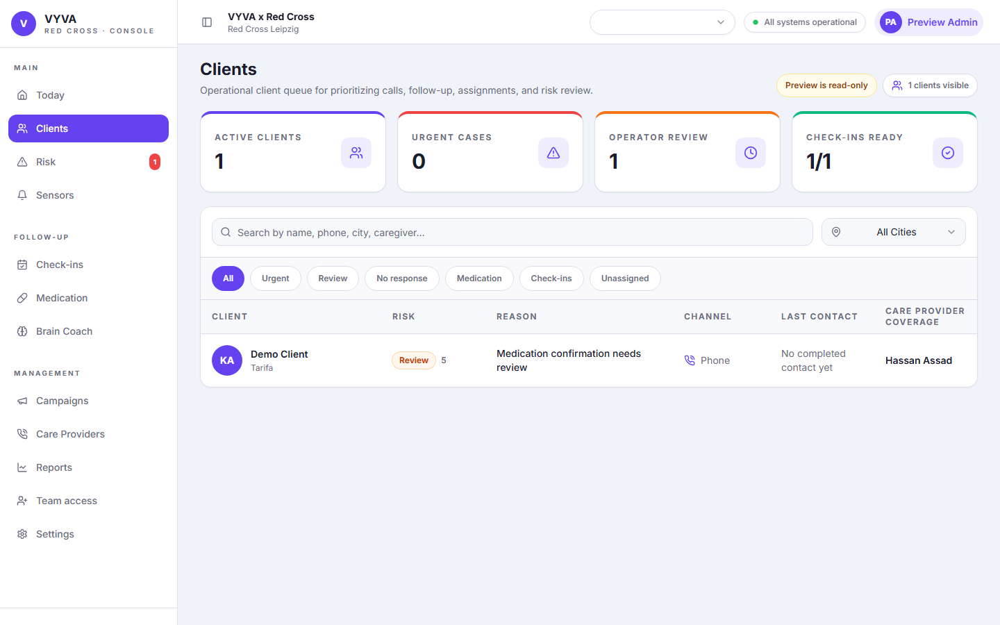
*Panel Today con métricas operativas, filtros y mapa superior.*

## 7. Clientes
Clientes es la cola principal de personas atendidas. Desde aquí se puede buscar por nombre, teléfono, ciudad o cuidador, filtrar por urgencia, revisión, sin respuesta, medicación, check-ins o sin asignar, y abrir el perfil del cliente.
La página tiene tres entradas de creación: Add client para crear uno a uno, Import clients para CSV y API intake para usuarios que llegan desde onboarding externo. Estas acciones son para clientes, no para miembros del equipo.
1. Usar Add client cuando un admin crea un cliente directamente.
2. Usar Import clients cuando se cargan varios clientes con CSV.
3. Usar API intake cuando los datos ya existen en el backend de onboarding.
4. Abrir una fila para revisar el perfil y la cobertura de cuidado.

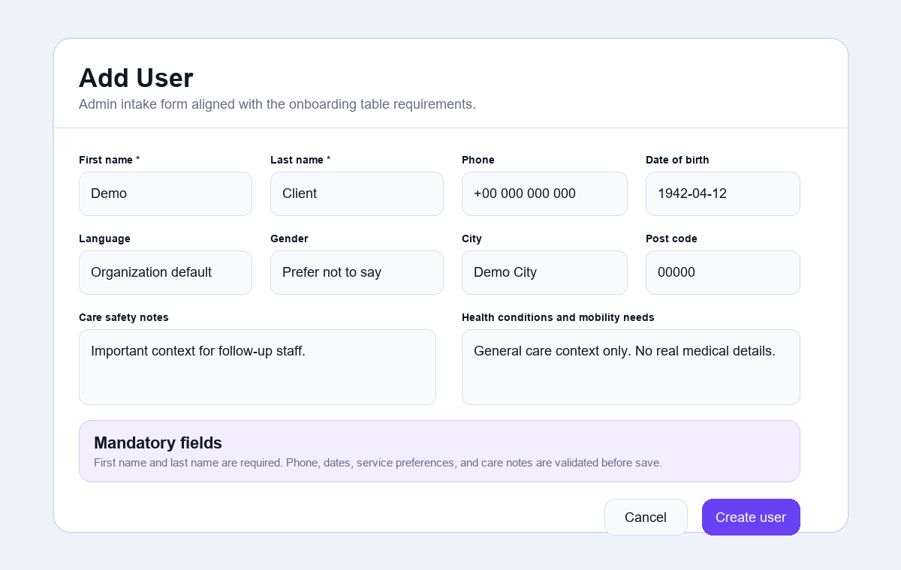
*Lista de clientes con búsqueda, filtros y cobertura de cuidado.*

## 8. Crear o importar clientes
El formulario de cliente debe recoger datos operativos de cuidado en secciones claras: persona y contacto, perfil médico mínimo, medicación, consentimiento, contacto de emergencia y rutinas de seguimiento.
El teléfono debe mostrar formato internacional claro, empezando por + y código de país. Esto ayuda a enrutar correctamente por organización y a evitar números inválidos.
El CSV debe respetar las mismas reglas de mínima información necesaria y nunca crear miembros de equipo por error. Los contactos de emergencia importados deben quedar como contactos personales, no como personal Cruz Roja.
- Nombre y apellidos son obligatorios.
- Teléfono debe estar en formato internacional.
- Consentimiento controla llamadas rutinarias.
- Solo se pide información médica útil para coordinación.
- Sensores quedan fuera hasta que el backend esté listo.

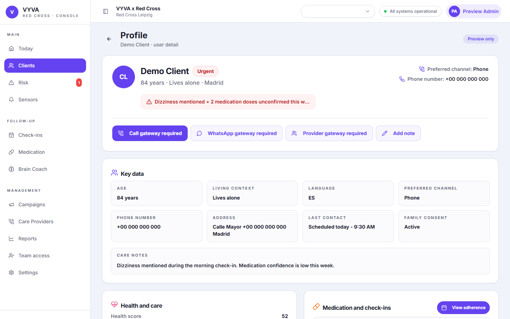
*Formulario de alta de cliente con datos de contacto y perfil de cuidado.*

## 9. Perfil del cliente
El perfil del cliente es la vista de trabajo principal para una persona atendida. Debe mostrar nombre, ciudad, estado, teléfono, idioma, dirección, consentimiento, último contacto y cobertura de cuidado sin textos de relleno como Unknown cuando exista información real.
La tarjeta de medicación y check-ins debe mostrar medicamentos, horarios, frecuencia y botones de edición si el usuario tiene permisos. Ver adherencia abre el calendario semanal de medicación por cliente.
Las acciones Call now, Send WhatsApp y Contact care provider deben informar que se requiere conexión de pasarela cuando todavía no hay integración activa. No deben simular una llamada o mensaje realizado.
- Datos clave: edad, teléfono, idioma, dirección, consentimiento y último contacto.
- Salud y cuidado: condiciones, movilidad y notas mínimas de seguridad.
- Medicación y check-ins: medicamentos, horarios y rutinas.
- Cobertura: contacto de emergencia y personal Cruz Roja principal.
- Actividad: eventos reales ordenados por fecha.

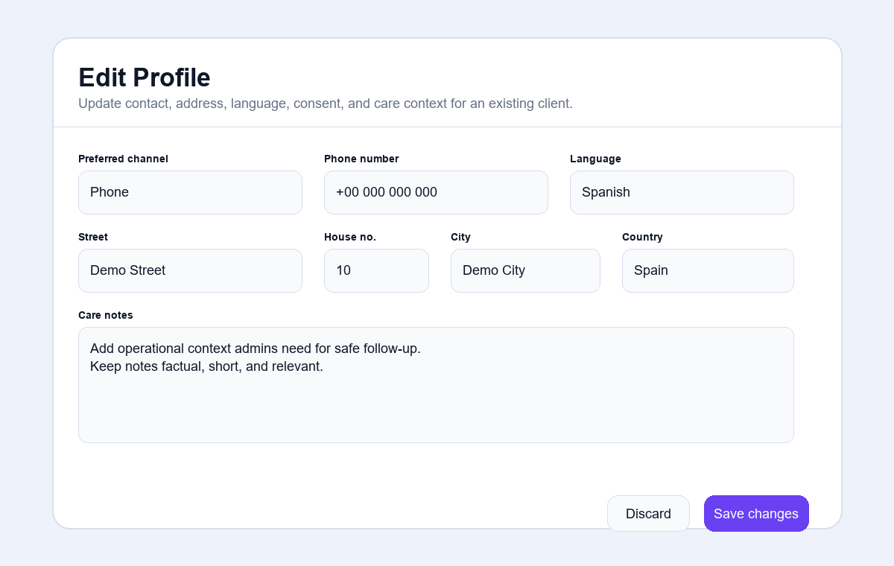
*Perfil del cliente con datos clave, estado, acciones y tarjetas de cuidado.*

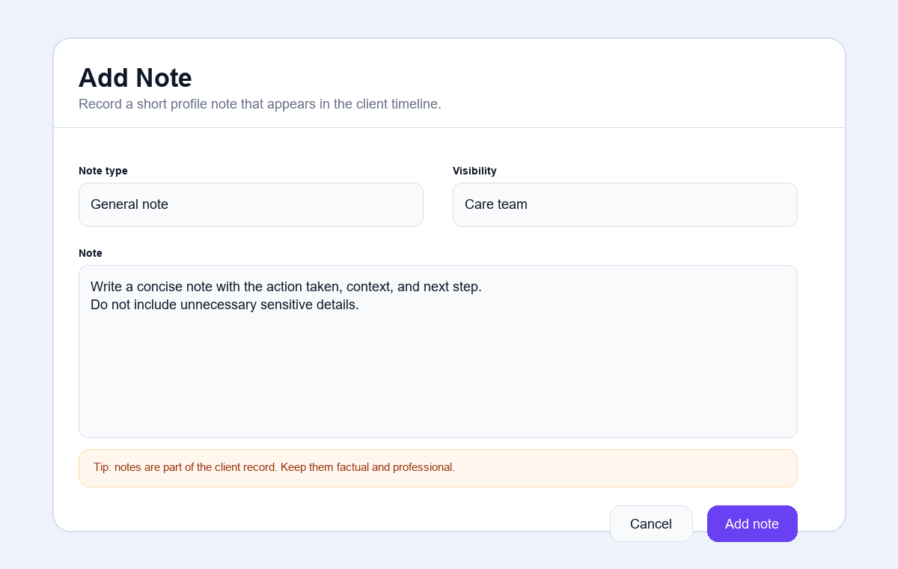
*Tarjeta de medicación, check-ins y Brain Coach del cliente.*

## 10. Contactos de emergencia
Los contactos de emergencia son personas de apoyo no profesionales: familiares, vecinos, cuidadores informales u otros contactos personales. Se capturan durante onboarding, llamadas entrantes o el formulario de cliente.
La página Contactos de emergencia debe listar solo estos contactos personales. No debe mezclar personal Cruz Roja. La tabla debe incluir nombre, relación o rol, teléfono, fuente, clientes vinculados y número de asignaciones.
Un cliente puede tener varios contactos de emergencia y un contacto puede estar vinculado a varios clientes. La vista de perfil debe evitar repetir el mismo contacto como resumen y como detalle de forma confusa.

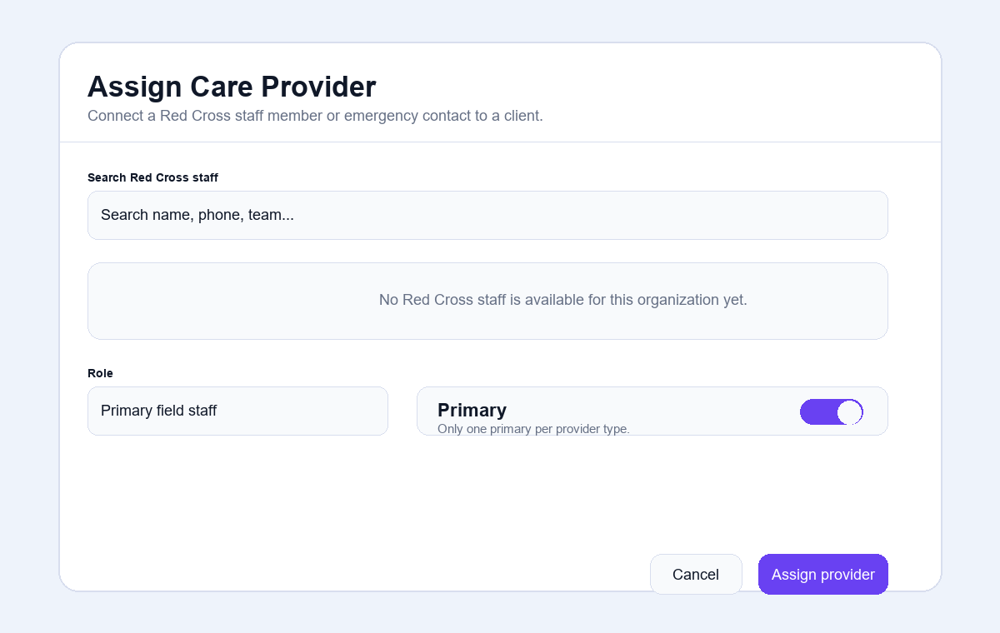
*Directorio de contactos de emergencia capturados durante onboarding o intake.*

## 11. Personal Cruz Roja
El personal Cruz Roja representa profesionales o equipo operativo. Debe gestionarse separado de los contactos de emergencia. La asignación de personal debe pedir un rol profesional mediante desplegable, no una relación familiar.
Un cliente puede tener personal profesional asignado. El sistema debe diferenciar el personal principal de otros apoyos profesionales. Esta asignación puede habilitar permisos de edición cuando el usuario asignado es responsable principal.
- Ejemplos de rol: coordinador de campo, operador principal, apoyo de medicación, trabajador social, supervisor.
- No usar Daughter, neighbor o caregiver como rol de personal profesional.
- Si no hay personal disponible, la UI debe indicar que falta crear registros de personal para la organización activa.

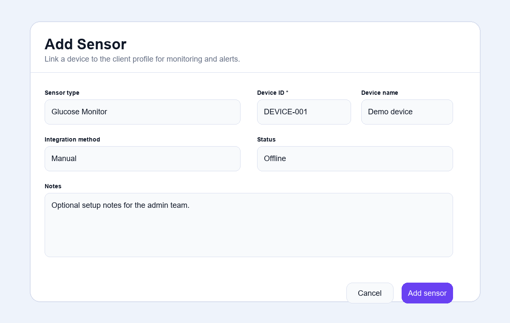
*Asignación de personal profesional Cruz Roja separada de contactos personales.*

## 12. Check-ins
Check-ins es solo para llamadas de seguimiento o check-up calls. Brain Coach no debe aparecer en esta página. Cada fila debe mostrar cliente, teléfono, tipo, estado, último check-in, frecuencia, hora preferida y acciones.
El último check-in debe venir de actividad real. Si la llamada programada ya pasó y no hay registro de éxito, debe mostrar Missed today o equivalente. Si fue confirmada, debe mostrar Confirmed o Completed. Si se activó protocolo de emergencia, debe mostrarse Escalated.
Los admins y el personal Cruz Roja principal pueden editar horarios cuando hay consentimiento. Los contactos de emergencia no pueden editar rutinas.
| Estado | Significado |
| --- | --- |
| Active | La rutina está habilitada. |
| Missed | La llamada esperada pasó sin confirmación. |
| Confirmed / Completed | La llamada fue completada con resultado válido. |
| Escalated | Se activó protocolo de emergencia o revisión crítica. |
| Cancelled | La rutina o llamada fue cancelada correctamente. |

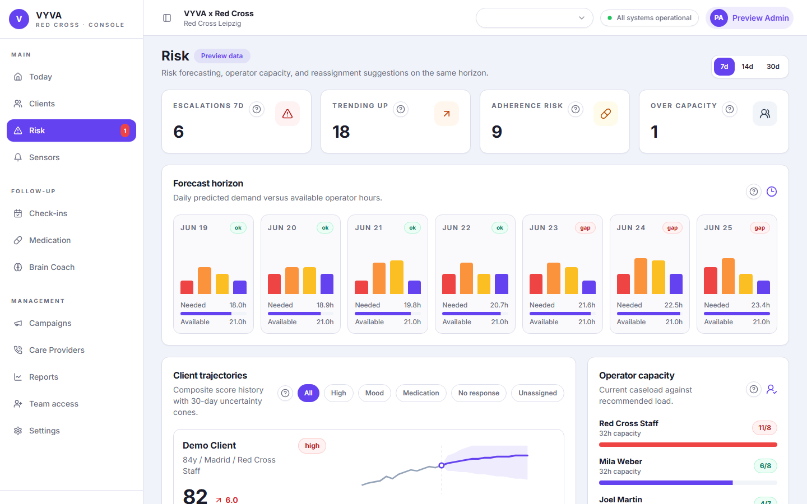
*Vista de check-ins con frecuencia, hora preferida y último estado registrado.*

## 13. Brain Coach
Brain Coach tiene una página separada de sesiones. La tabla muestra clientes con rutina cognitiva activa o inactiva, teléfono, frecuencia, hora preferida y acciones.
El icono de reporte debe abrir la página de reporte de actividad cognitiva, no el perfil general. El reporte muestra promedio, sesiones completadas, total de preguntas, racha y detalle por periodo de 7, 30 o 90 días.
La actividad del perfil debe mostrar la última sesión registrada, no solo que la rutina está activa. Si no hay sesiones, debe mostrar un estado claro como sin historial todavía.

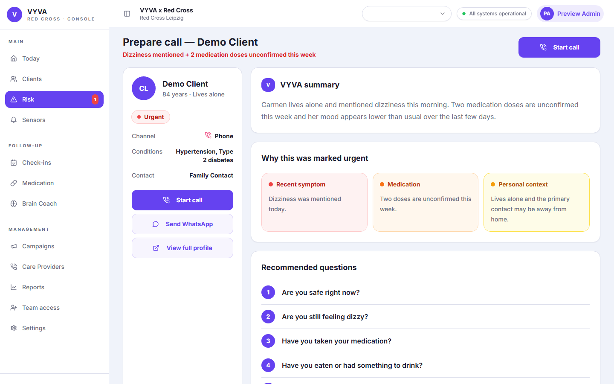
*Sesiones Brain Coach y acceso al reporte de actividad cognitiva.*

## 14. Medicación y adherencia
Medicación permite revisar señales relacionadas con medicamentos y abrir la adherencia semanal por cliente. La página de adherencia muestra medicamentos por fila y días por columna.
El formulario de medicación debe incluir nombre, dosis, propósito, horarios, frecuencia y si los recordatorios están activos. La frecuencia es necesaria para interpretar correctamente recordatorios y adherencia.
Los estados del calendario son tomado, perdido, sin confirmar y próximo. Las dosis pasadas sin registro deben aparecer como sin confirmar, no como próximas.
- Admins pueden editar medicamentos.
- Personal Cruz Roja principal puede editar si tiene permiso operativo.
- Los contactos de emergencia no editan medicación.
- No incluir información médica extensa si no es necesaria para coordinación.

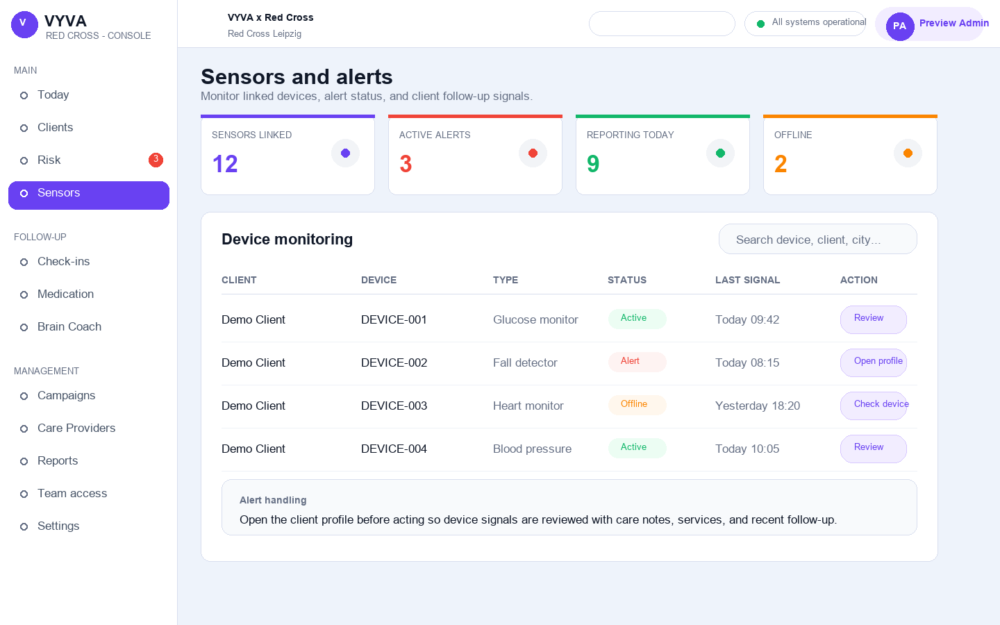
*Calendario semanal de adherencia por medicamento y estado de dosis.*

## 15. Riesgo
Riesgo prioriza trabajo operativo. La página debe mostrar tarjetas de Urgente, Revisión, Sin respuesta, Medicación y Sin asignar. Cada tarjeta debe incluir una ayuda con explicación de cómo se calcula el número.
La cola debe actualizarse según señales reales: check-ins perdidos, medicación sin confirmar, falta de cobertura, escalaciones y eventos recientes. Si no hay casos, debe explicar qué señales generarían entradas.
- Urgente: requiere acción inmediata.
- Revisión: requiere evaluación del operador.
- Sin respuesta: no se obtuvo confirmación en rutinas o campañas.
- Medicación: señales de adherencia o confirmación pendiente.
- Sin asignar: falta responsable o cobertura.

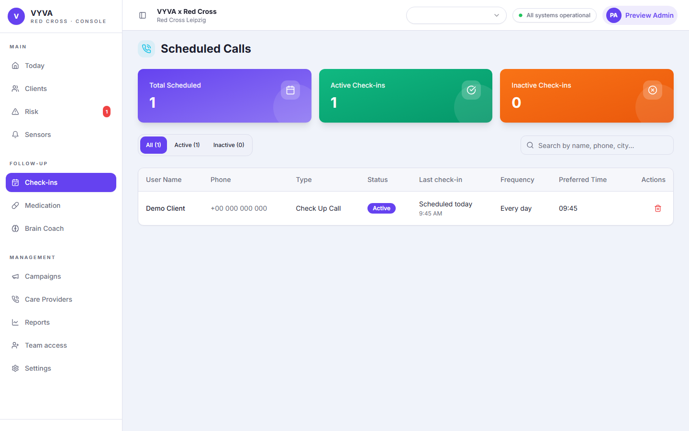
*Cola de riesgo con tarjetas explicables y filtros operativos.*

## 16. Sensores
Sensores reemplaza la etiqueta Alerts. Por ahora puede existir como sección preparada para dispositivos y señales futuras. Si el backend de sensores no existe, la UI debe explicar claramente que todavía no hay datos conectados.
No debe inventar datos de sensores. Cuando haya integración, la página podrá mostrar dispositivos, alertas, batería, conexión y eventos recientes.

## 17. Campañas de llamadas VYVA
Campañas es un espacio de llamadas VYVA, no una herramienta genérica multicanal. El flujo correcto es seleccionar una plantilla, definir audiencia, escribir o generar el guion, revisar destinatarios y guardar, programar o poner en cola.
Las plantillas disponibles incluyen anuncio general, alerta de ola de calor, recordatorio de vacunación, alerta de estafas, actualización de servicios y crear tu propia campaña.
La opción de IA ayuda al admin a escribir unas palabras sobre el objetivo y generar un primer borrador del guion. El texto siempre debe ser editable antes de guardar o poner en cola.
1. Elegir plantilla o Crear tu propia.
2. Definir reglas de público objetivo.
3. Editar el guion de llamada.
4. Previsualizar destinatarios elegibles y omitidos.
5. Guardar borrador, programar llamadas o poner en cola.

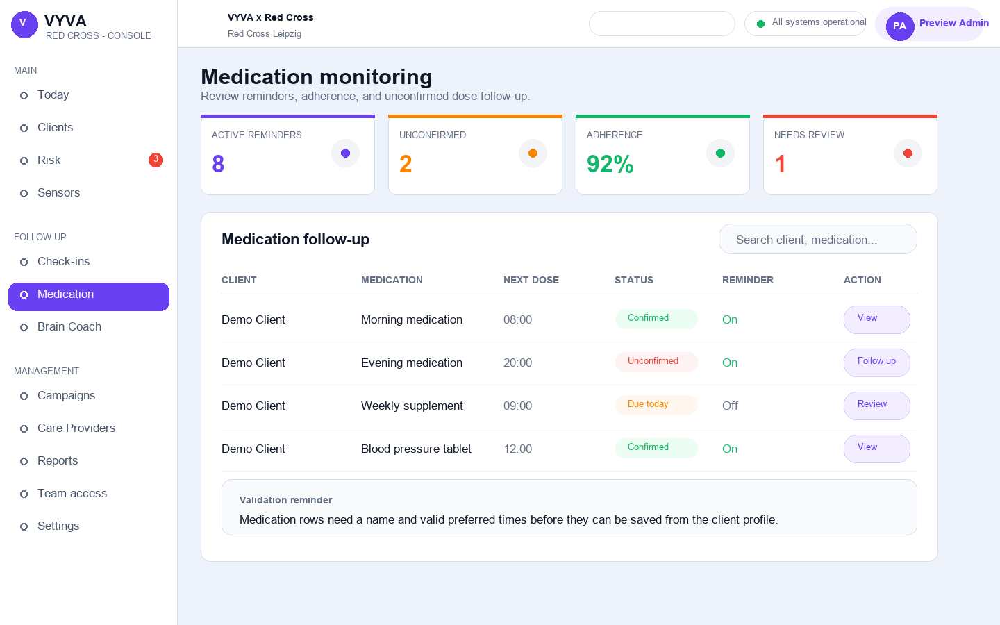
*Campañas de llamadas VYVA con plantillas, estados y acciones de cola.*

## 18. Segmentación inteligente de campañas
La segmentación debe ser práctica y entendible para administradores. En lugar de un texto libre llamado target summary, la consola debe ofrecer reglas claras: geografía, riesgo, condición de salud, proveedor asignado, consentimiento y teléfono.
Consentimiento y teléfono deben estar activados por defecto como salvaguardas. La previsualización debe mostrar cuántos clientes son elegibles y cuántos se omiten, con razones como sin teléfono, sin consentimiento, fuera del área, sin condición seleccionada o proveedor no coincidente.
- Dónde: toda la organización, país, ciudad o área.
- Quién: todos, estable, revisión, urgente o alto riesgo.
- Salud: condiciones registradas en el perfil del cliente.
- Cobertura: todos, sin asignar o asignados a un proveedor concreto.
- Salvaguardas: teléfono y consentimiento.

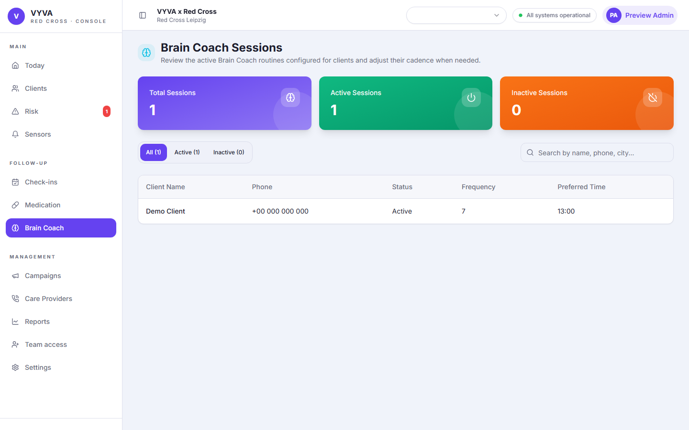
*Constructor de audiencia por geografía, riesgo, condiciones y cobertura.*

## 19. Team access
Team access sirve para crear cuentas de personal con acceso a la consola. No crea clientes. El texto debe decir Add team member y explicar que es para staff console access only.
Los admins de organización pueden crear miembros del equipo dentro de su organización. Los superadmins pueden crear administradores por organización. La creación o promoción de superadmins queda fuera de la UI.

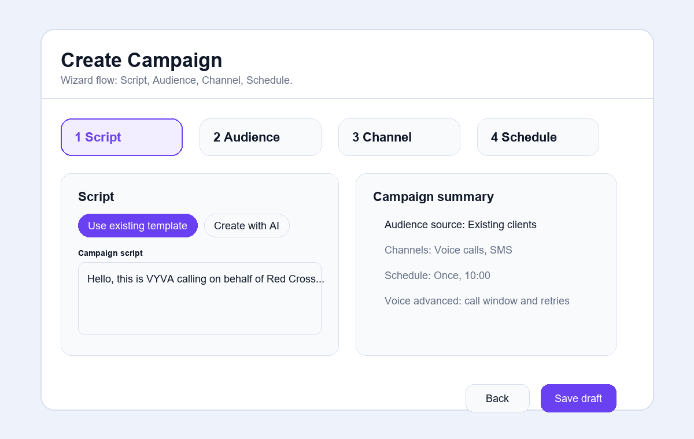
*Gestión de acceso para miembros del equipo, separada de clientes.*

## 20. Configuración e idioma
Configuración muestra la organización activa, país, idioma por defecto y zona horaria. Los admins pueden cambiar valores permitidos según rol. El idioma de la consola puede ser inglés, alemán o español.
La página debe tener una forma clara de volver a la consola. Los cambios de organización o idioma deben actualizar la UI sin dejar datos mezclados de otra organización.

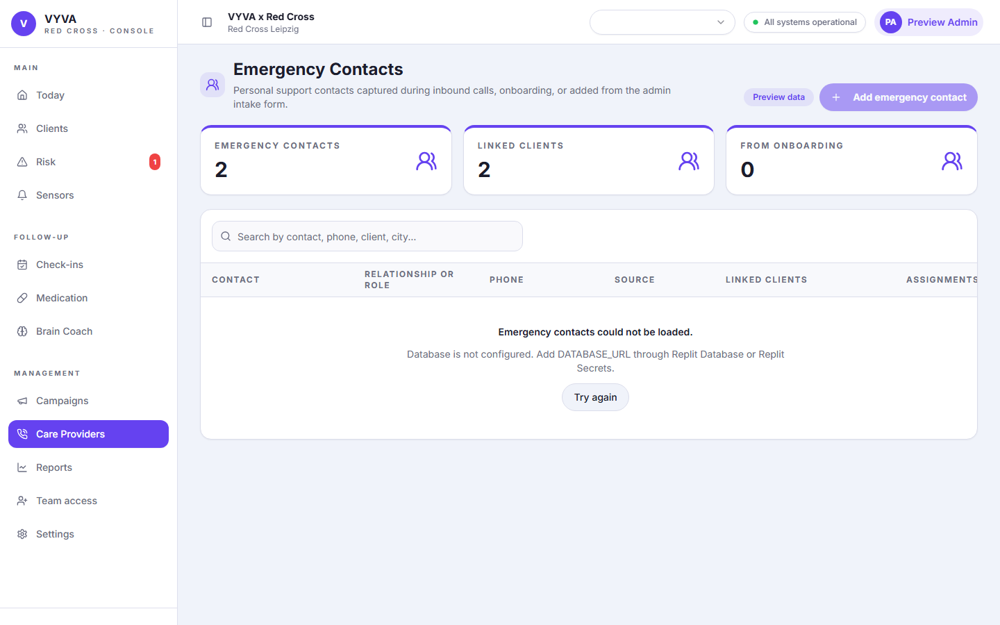
*Configuración de organización activa, idioma y zona horaria.*

## 21. Informes
Informes resume actividad útil para coordinación. Puede incluir campañas, check-ins, medicación, servicios, estado de población y tendencias por organización.
Todos los informes deben respetar la organización activa. Si el superadmin cambia de Zamora a Leipzig, los datos deben cambiar también.

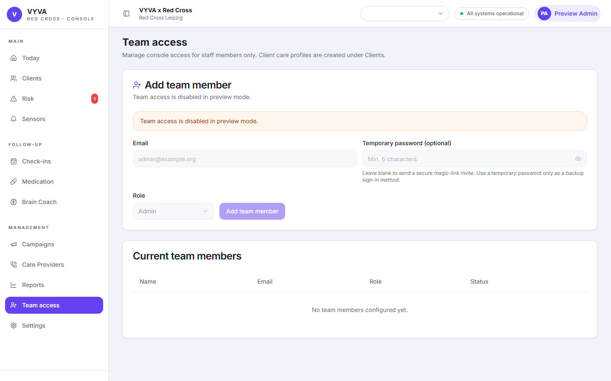
*Informes operativos para revisar actividad y métricas por organización.*

## 22. Actividad del cliente
La actividad del cliente debe registrar eventos reales, no solo configuraciones activas. Por ejemplo, debe mostrar último check-in realizado o perdido, última sesión Brain Coach registrada, último evento de medicación, consentimiento registrado, asignación de cuidado y cambios relevantes.
No es útil mostrar únicamente 'Brain Coach sessions active' o 'Medication plan has 2 items' como actividad. Eso describe configuración, no actividad. La línea temporal debe priorizar acciones y eventos.

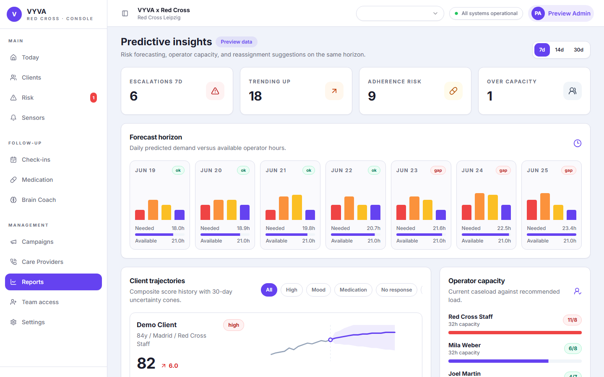
*Línea de tiempo con acciones reales: onboarding, llamadas, medicación y sesiones.*

## 23. Comunicaciones y pasarelas
Hasta que existan conectores de voz, WhatsApp o proveedor de llamadas, los botones de comunicación deben decir que se requiere una conexión de pasarela. Esto evita que el operador crea que se llamó, se escribió o se contactó a alguien cuando no ocurrió.
Las campañas pueden preparar y poner en cola trabajos, pero no deben iniciar llamadas reales si el conector de voz no está configurado.

## 24. Seguridad, privacidad y mínimo necesario
La consola debe seguir una regla de mínimo necesario. Registrar solo lo que ayuda al equipo a coordinar cuidado y seguimiento. Evitar diagnósticos narrativos extensos, datos financieros, aseguradoras o información clínica no operativa.
Los mensajes de éxito o error no deben incluir nombres, teléfonos, medicaciones o condiciones médicas. Los logs tampoco deben exponer PHI innecesaria.
- No guardar borradores médicos en localStorage o sessionStorage.
- No registrar datos sensibles en toasts o consola.
- Validar consentimiento antes de llamadas rutinarias.
- Separar contactos personales de personal profesional.
- Mantener superadmin fuera de flujos de UI normales.

## 25. Solución de problemas
Si no llega el enlace mágico, revisar que el proveedor de correo tenga créditos, dominio verificado y remitente configurado. La consola debe mostrar errores concretos como falta de remitente, límite de créditos o espera temporal.
Si una página queda en blanco, revisar el error de renderizado, refrescar la página y confirmar que la última publicación se completó correctamente. Las páginas críticas deben mostrar un estado de error claro en lugar de quedar vacías.
Si los datos no cambian al cambiar de organización, revisar que el endpoint recibe el contexto de organización y que no existe caché compartida entre organizaciones.
